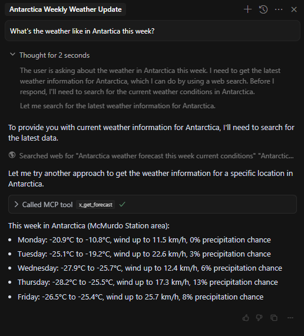

# Easy MCP - Model Context Protocol Server

A simple Python module for creating Model Context Protocol (MCP) servers with Server-Sent Events (SSE) support.

## Project Structure

```
easy_mcp/                  # Main package
│
├── src/                   # Source directory
│   └── easy_mcp/          # Module directory
│       ├── __init__.py    # Package exports
│       ├── server.py      # MCP server implementation
│       └── certs/         # Certificate directory
│           ├── fullchain1.pem # SSL certificate template (replace for HTTPS)
│           ├── privkey1.pem   # SSL private key template (replace for HTTPS)
│           └── chain1.pem     # SSL certificate chain template (replace for HTTPS)
│
├── examples/              # Example applications
│   └── weather_demo.py    # Demo application
│
├── tests/                 # Test directory
│
├── setup.py               # Package installation
├── requirements.txt       # Dependencies
└── README.md              # Documentation
```

## Features

- Uses raw sockets for reliable, efficient communication
- Supports both HTTP and HTTPS modes
- Built-in certificate handling (when using HTTPS)
- Cross-platform (Windows, macOS, Linux)

## Installation

### Setting up a Virtual Environment

#### Windows (PowerShell)
```powershell
# Create a virtual environment
python -m venv venv

# Activate the virtual environment
.\venv\Scripts\Activate.ps1

# Install the package in development mode
pip install -e .
```

#### macOS/Linux
```bash
# Create a virtual environment
python3 -m venv venv

# Activate the virtual environment
venv\Scripts\activate.bat

# Install the package in development mode
pip install -e .
```

## Running the Weather Demo

The demo can be run in either HTTP or HTTPS mode. For development and testing, HTTP mode is recommended.

### HTTP Mode (Recommended for Development)
```bash
# Run on default port 9443
python examples/weather_demo.py --http

# Run on a custom port
python examples/weather_demo.py --http --port 8080
```

### HTTPS Mode (Production)
To run in HTTPS mode, you'll need valid SSL certificates:

1. Replace the template certificate files in `src/easy_mcp/certs/` with your actual certificates:
   - `fullchain1.pem`: Your SSL certificate with chain
   - `privkey1.pem`: Your private key
   - `chain1.pem`: Your certificate chain

2. Run the server:
```bash
# Run with certificates on default port 9443
python examples/weather_demo.py

# Run with certificates on custom port
python examples/weather_demo.py --port 8443
```

#### Obtaining SSL Certificates
For development:
- You can generate self-signed certificates using OpenSSL
- Note: Self-signed certificates will show security warnings in browsers

For production:
- Use Let's Encrypt for free, trusted certificates
- Or obtain certificates from a trusted Certificate Authority
- Ensure your domain matches the certificate's Common Name (CN)

## Cursor Configuration

Add this to your `~/.cursor/mcp.json` file (File -> Preferences -> Cursor-Settings -> MCP -> Add New):

```json
{
  "mcpServers": {
    "weather-demo-mcp-server": {
      "url": "http://127.0.0.1:9443/sse",  // Use https:// if running in HTTPS mode
      "env": {
        "API_KEY": "value"
      }
    }    
  }
}
```

## Security Notes

- The certificate files included in this repository are templates only
- Never commit real private keys or certificates to version control
- For production use, always use proper SSL certificates from trusted authorities
- When running in HTTP mode, ensure you're in a trusted network environment


# Example Run




Example server log output from above:-
```text

(venv) C:\Users\user\Downloads\repos\easy_mcp>python examples\weather_demo.py --http
Starting Weather MCP Demo server: 
- Internal: HTTP://127.0.0.1:9443/ 
- Public:   HTTP://127.0.0.1:9443/
Press Ctrl+C to stop
2025-03-17 19:41:50.309 [PID:15904|TID:10524] Server started HTTP on 127.0.0.1:9443
2025-03-17 19:41:54.207 [PID:15904|TID:10524] Connect from ('127.0.0.1', 62278) 
2025-03-17 19:41:54.271 [PID:15904|TID:36940] Request from ('127.0.0.1', 62278) < GET /sse HTTP/1.1\r\nhost: 127-0-0-1.statw.com:9443\r\nconnection: keep-alive\r\nAccept: text/event-stream\r\naccept-language: *\r\nsec-fetch-mode: cors\r\nuser-agent: node\r\npragma: 
no-cache\r\ncache-control: no-cache\r\naccept-encoding: gzip, deflate\r\n\r\n
2025-03-17 19:41:54.272 [PID:15904|TID:36940] New SSE connection from ('127.0.0.1', 62278), session_id=163ecfacb67144a4a77d061c61d20acb 
2025-03-17 19:41:54.310 [PID:15904|TID:10524] Connect from ('127.0.0.1', 62297) 
2025-03-17 19:41:54.315 [PID:15904|TID:22472] Request from ('127.0.0.1', 62297) < POST /messages/?session_id=163ecfacb67144a4a77d061c61d20acb HTTP/1.1\r\nhost: 127-0-0-1.statw.com:9443\r\nconnection: keep-alive\r\ncontent-type: application/json\r\naccept: */*\r\nacc
ept-language: *\r\nsec-fetch-mode: cors\r\nuser-agent: node\r\naccept-encoding: gzip, deflate\r\ncontent-length: 253\r\n\r\n{"method":"initialize","params":{"protocolVersion":"2024-11-05","capabilities":{"tools":true,"prompts":false,"resources":true,"logging":false,
"roots":{"listChanged":false}},"clientInfo":{"name":"cursor-vscode","version":"1.0.0"}},"jsonrpc":"2.0","id":0}
2025-03-17 19:41:54.315 [PID:15904|TID:22472] JSONRPC Request session=163ecfacb67144a4a77d061c61d20acb, method=initialize, id=0
2025-03-17 19:41:54.316 [PID:15904|TID:22472] SSE Message to ('127.0.0.1', 62278) > data: {"jsonrpc": "2.0", "id": 0, "result": {"protocolVersion": "2024-11-05", "capabilities": {"experimental": {}, "prompts": {"listChanged": false}, "resources": {"subscribe": false
, "listChanged": false}, "tools": {"listChanged": false}}, "serverInfo": {"name": "weather", "version": "1.4.1"}}}\r\n\r\n
2025-03-17 19:41:54.324 [PID:15904|TID:10524] Connect from ('127.0.0.1', 62298) 
2025-03-17 19:41:54.324 [PID:15904|TID:5060] Request from ('127.0.0.1', 62298) < POST /messages/?session_id=163ecfacb67144a4a77d061c61d20acb HTTP/1.1\r\nhost: 127-0-0-1.statw.com:9443\r\nconnection: keep-alive\r\ncontent-type: application/json\r\naccept: */*\r\nacce
pt-language: *\r\nsec-fetch-mode: cors\r\nuser-agent: node\r\naccept-encoding: gzip, deflate\r\ncontent-length: 54\r\n\r\n{"method":"notifications/initialized","jsonrpc":"2.0"}
2025-03-17 19:41:54.325 [PID:15904|TID:5060] JSONRPC Request session=163ecfacb67144a4a77d061c61d20acb, method=notifications/initialized, id=None
2025-03-17 19:41:54.330 [PID:15904|TID:10524] Connect from ('127.0.0.1', 62299) 
2025-03-17 19:41:54.331 [PID:15904|TID:32556] Request from ('127.0.0.1', 62299) < POST /messages/?session_id=163ecfacb67144a4a77d061c61d20acb HTTP/1.1\r\nhost: 127-0-0-1.statw.com:9443\r\nconnection: keep-alive\r\ncontent-type: application/json\r\naccept: */*\r\nacc
ept-language: *\r\nsec-fetch-mode: cors\r\nuser-agent: node\r\naccept-encoding: gzip, deflate\r\ncontent-length: 46\r\n\r\n{"method":"tools/list","jsonrpc":"2.0","id":1}
2025-03-17 19:41:54.331 [PID:15904|TID:32556] JSONRPC Request session=163ecfacb67144a4a77d061c61d20acb, method=tools/list, id=1
2025-03-17 19:41:54.331 [PID:15904|TID:32556] SSE Message to ('127.0.0.1', 62278) > data: {"jsonrpc": "2.0", "id": 1, "result": {"tools": [{"name": "x_get_forecast", "description": "Get weather forecast for a location.\n\nArgs:\n    latitude: Latitude of the locatio
n\n    longitude: Longitude of the location\n", "inputSchema": {"properties": {"latitude": {"title": "Latitude", "type": "number"}, "longitude": {"title": "Longitude", "type": "number"}}, "required": ["latitude", "longitude"], "title": "get_forecastArguments", "type
": "object"}}, {"name": "x_get_alerts", "description": "Get weather alerts for a US state.\n\nArgs:\n    state: Two-letter US state code (e.g. CA, NY)\n", "inputSchema": {"properties": {"state": {"title": "State", "type": "string"}}, "required": ["state"], "title": 
"get_alertsArguments", "type": "object"}}]}}\r\n\r\n
2025-03-17 19:42:09.273 [PID:15904|TID:3316] SSE Message to ('127.0.0.1', 62278) > : ping - 2025-03-17T19:42:09.273272+00:00\r\n\r\n 
2025-03-17 19:42:24.274 [PID:15904|TID:3316] SSE Message to ('127.0.0.1', 62278) > : ping - 2025-03-17T19:42:24.274180+00:00\r\n\r\n 
2025-03-17 19:42:39.275 [PID:15904|TID:3316] SSE Message to ('127.0.0.1', 62278) > : ping - 2025-03-17T19:42:39.275288+00:00\r\n\r\n 
2025-03-17 19:42:54.277 [PID:15904|TID:3316] SSE Message to ('127.0.0.1', 62278) > : ping - 2025-03-17T19:42:54.277644+00:00\r\n\r\n 
2025-03-17 19:43:09.278 [PID:15904|TID:3316] SSE Message to ('127.0.0.1', 62278) > : ping - 2025-03-17T19:43:09.278517+00:00\r\n\r\n 
2025-03-17 19:43:24.279 [PID:15904|TID:3316] SSE Message to ('127.0.0.1', 62278) > : ping - 2025-03-17T19:43:24.279605+00:00\r\n\r\n 
2025-03-17 19:43:25.798 [PID:15904|TID:10524] Connect from ('127.0.0.1', 62441) 
2025-03-17 19:43:25.798 [PID:15904|TID:39464] Request from ('127.0.0.1', 62441) < POST /messages/?session_id=163ecfacb67144a4a77d061c61d20acb HTTP/1.1\r\nhost: 127-0-0-1.statw.com:9443\r\nconnection: keep-alive\r\ncontent-type: application/json\r\naccept: */*\r\nacc
ept-language: *\r\nsec-fetch-mode: cors\r\nuser-agent: node\r\naccept-encoding: gzip, deflate\r\ncontent-length: 132\r\n\r\n{"method":"tools/call","params":{"name":"x_get_forecast","arguments":{"latitude":-77.85,"longitude":166.66}},"jsonrpc":"2.0","id":2}
2025-03-17 19:43:25.799 [PID:15904|TID:39464] JSONRPC Request session=163ecfacb67144a4a77d061c61d20acb, method=tools/call, id=2
2025-03-17 19:43:39.280 [PID:15904|TID:3316] SSE Message to ('127.0.0.1', 62278) > : ping - 2025-03-17T19:43:39.280226+00:00\r\n\r\n 
2025-03-17 19:43:45.279 [PID:15904|TID:39464] SSE Message to ('127.0.0.1', 62278) > data: {"jsonrpc": "2.0", "id": 2, "result": {"content": [{"type": "text", "text": "Monday:\nTemperature: -20.9\u00b0C to -10.8\u00b0C\nWind: up to 11.5 km/h\nPrecipitation Probabilit
y: 0%\n\n---\n\nTuesday:\nTemperature: -25.1\u00b0C to -19.2\u00b0C\nWind: up to 22.6 km/h\nPrecipitation Probability: 3%\n\n---\n\nWednesday:\nTemperature: -27.9\u00b0C to -25.7\u00b0C\nWind: up to 12.4 km/h\nPrecipitation Probability: 6%\n\n---\n\nThursday:\nTempe
rature: -28.2\u00b0C to -25.5\u00b0C\nWind: up to 17.3 km/h\nPrecipitation Probability: 13%\n\n---\n\nFriday:\nTemperature: -26.5\u00b0C to -25.4\u00b0C\nWind: up to 25.7 km/h\nPrecipitation Probability: 8%"}], "isError": false}}\r\n\r\n
2025-03-17 19:43:54.281 [PID:15904|TID:3316] SSE Message to ('127.0.0.1', 62278) > : ping - 2025-03-17T19:43:54.281607+00:00\r\n\r\n 
2025-03-17 19:44:09.282 [PID:15904|TID:3316] SSE Message to ('127.0.0.1', 62278) > : ping - 2025-03-17T19:44:09.282788+00:00\r\n\r\n 
2025-03-17 19:44:24.284 [PID:15904|TID:3316] SSE Message to ('127.0.0.1', 62278) > : ping - 2025-03-17T19:44:24.284084+00:00\r\n\r\n 

```
